# Battleships

## Overview 
---
This project is a computerised game of battleships housed in a mock terminal on Heroku. The project has been an opportunity to gain knowledge and experience in an object orientated language, here python, and use classes, methods and nested 'if' statements along with ASCII artwork to create an enjoyable bug free playable game where a user faces the computer with two difficulty settings

To see the finished product please follow the link below by clicking Ctrl + the link to open in a new tab: 

[Link to Heroku - Battle Ships](https://dashboard.heroku.com/apps/project3battleships)

## Table of Contents 

* [Overview](#overview)
* [Design](#design)
    * [User Needs](#user-needs)
    * [Aims](#aims)
    * [Plan of Attack](###plan-of-attack)
* [Features](#features)
    * [General Features](#general-features)
    * [Welcome Screen](#welcome-screen)
    * [Intro Sequence](#intro-sequence)
    * [Rules](#rules)
    * [Username Entry](#username-entry-including-error-handling)
    * [Easy or Hard Mode](#easy-or-hard-mode)
    * [Gameplay](#gameplay)
    * [Future Enhancements](#future-enhancements)
* [Libraries](#libraries)
* [Game Map](#game-map)
* [Testing](#testing)
* [Playing the Game](#playing-the-game)
* [Deployment to Heroku](#deployment-to-heroku)

## Design
---

### User Story:
---

### User needs 
Users will want to: 
* Understand what the game is from opening the app
* Have access to game instructions / rules from the opening screen
* Have a storyline to follow, more than just a simple game of battleships
* Be able to play the game without any bugs in a clear way
* Have access to a variety of difficulty settings 

### Aims
As a result of the above the aims are straight forward
* Make the purpose of the game clear from the offset
* Create a rules page that can be accessed by the user
* Produce a storyline for the user to follow with imagery
* Ensure no bugs are present in the game and it works as intended
* Create a Hard and Easy mode to play through 

### Plan of Attack

In order to achieve the above aims the app will: 
* Provide a welcome screen with ASCII artwork to make it clear what the game is
* The welcome screen will provide access to the game rules
* Use ASCII Art to create an engaging intro
* Ensure user inputs are usable by the code and that no bugs are present through testing
* Create more than one difficulty setting by allowing the ocmputer to guess more intelligently 

## Features

### General Features
---
In order to give the intro sequences a more smooth feel I employed a "slow type" function used throughout many of the other Python scripts. In places this replaced the print function to make the user feel more like they were watching an event unfold or part of a conversation. 

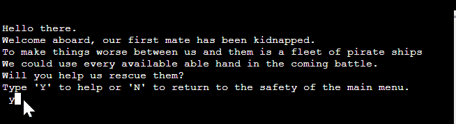

[return to contents](<#contents>)

### Welcome Screen
---
The welcome screen gives the user three options: 

1. Using 'P' the user is navigated through the full intro sequence before the main game
2. Using 'R' the user is navigated to the rules page
3. Using 'S' the user is navigated to the game skipping most of the intro sequence up to the username entry section

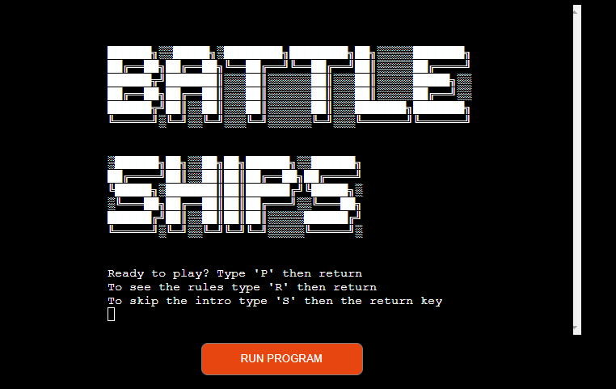

The code behind this allows the user to type either lower or uppercase letters to continue. If nothing or a letter which is not 'P', 'R' or 'S' is typed the screen refreshes and says "Let's try that again"

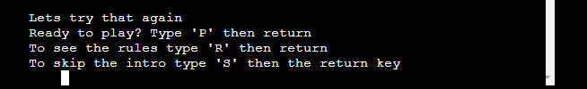

[return to contents](<#contents>)

### Intro Sequence
---
In order to create a story line to add intrigue to the game I employed ASCII artwork along with the slow type effect noted above to help the user feel engaged with the app. This sequence is accessed if the user selects the "Ready to play" option from the welcome screen by typing 'P'

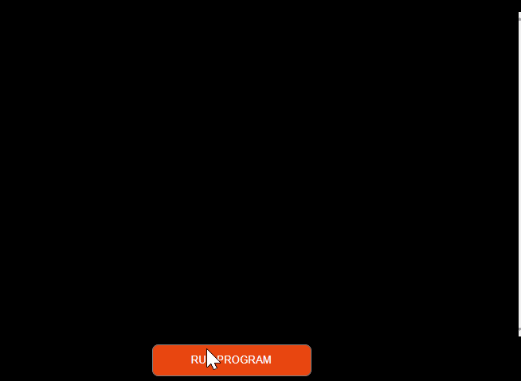

The user is given the option to return to the main menu from this point. The user can use upper or lowercase letters to coninue or to return to the main menu (this could be to double check the rules before playing)

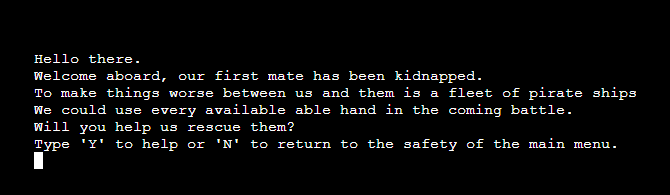

If the user enters something other than 'y' or 'n' the screen refreshes and they see the below

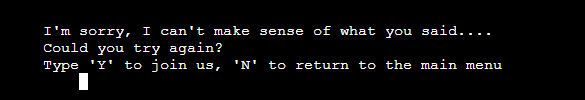

[return to contents](<#contents>)

### Rules
---
Accessed by typing 'R' the rules are two pages which add to the backstory of the game and explain what the user needs to know to play. They also justify why you can't see the enemy ships and why the ships are placed randomly throughout the board. The user is told to 'hit enter to continue', in reality any key can be pressed. 

Page 1: 

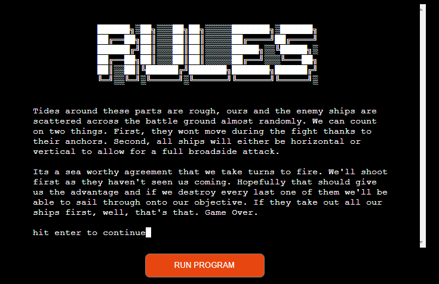

Page 2: 

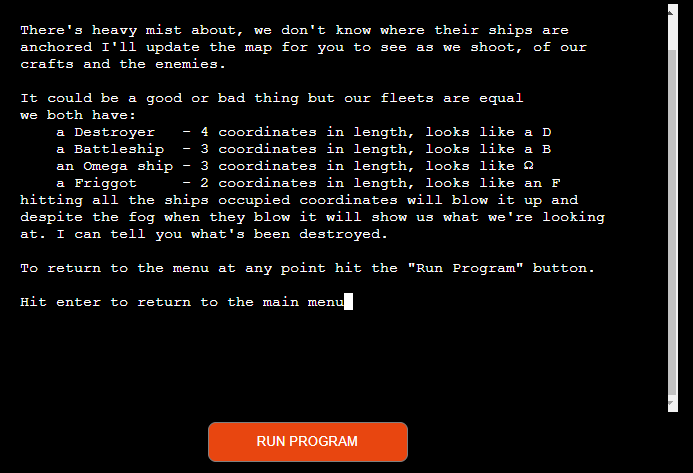

[return to contents](<#contents>)

### Username Entry including error handling
---

Whether the user selects 'P' or 'S' at the welcome screen they are either taken indirectly (via 'P') or directly (via 'S') to the username entry screen. To help the user feel engaged the app asks for their name. 

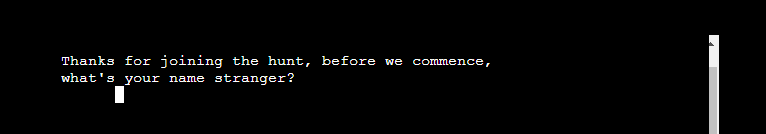

The user can enter anything they like here except for spaces or no username. This is done by stripping the input of all spaces and counting the length of the name left behind. If length of the input less spaces is zero they will see the screen below: 

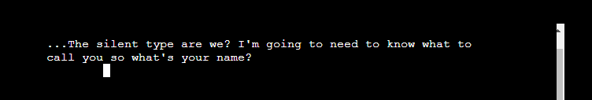

Once a working username is entered the user is welcomed onboard the ship and a short sequence is played saying "Lets Hunt Pirates... BATTLE SHIPS" (see the [intro sequence](<#intro-sequence>) or below to watch a truncated version: 

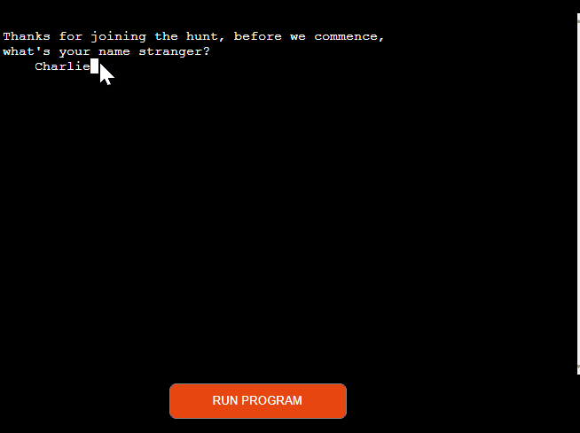

[return to contents](<#contents>)

### Easy or Hard Mode
---

The game has two modes, an easy mode or a hard mode and the user is invited to select which they would like in a text where easy and hard are capitalised to make it obvious what the text is asking the user to choose. 

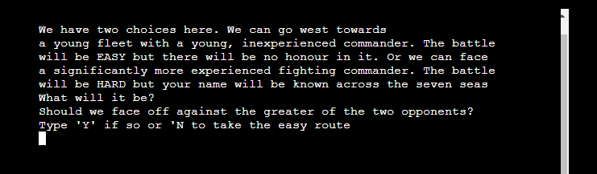

As with all selections so far upper or lower case can be used. If the user types something other than a 'y' or 'n' then they are invited to try again. The second time the text is printed to the terminal a "Print" is used instead of typing slowly as this is a big piece of text and watching it type out again could be frustrating: 

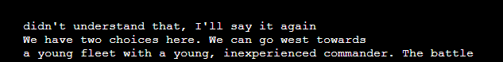

If the user selects 'Y' hardmode is activated (becomes True in the code) and the next text reads "Very Nice, we will be world famous". If easy is selected the text reads "Why risk it, lets get our first mate". 

The difference between the two modes is essentially: 

Easy - Each turn the computer guesses a random location regardless of whether or not it hit a target in the previous round. 

Hard - The computer guesses at random until it hits a target. Once it hits a target it iterates around the hit by one space to see if other targets are there. These are added to an array and the computer targets these coordinates in the next rounds until the array length is zero afterwhich the computer returns to guessing at random. 

In order to develop the hard mode I create a simulation in which the computer tried to clear the board as quick as it could without any user input. In Easy mode for a 5x5 board this took between 23 and 25 turns. With the hardmode iteration this bacame around 12 turns. When testing the game I beat the easy mode everytime. I beat hardmode around one in ten tries. 

[return to contents](<#contents>)

### Gameplay

Initially the user is presented with the view below showing their ship placement and a blank board for the computer: 

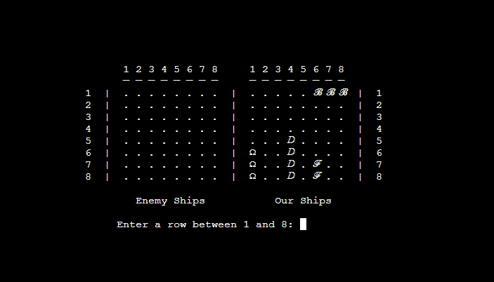

The user always goes first and must enter a row, then a column. If either the row or column chosen is not between 1 and 8 they are asked to choose again. 

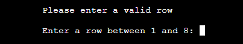

Once the user has chosen their first coordinate if they miss i.e. a ship is not at the coordinate they chose the text "Miss!" appears. They are then warned that the computer is taking their turn and "getting ready to shoot!!"

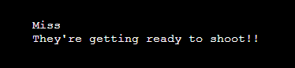

The user is then told if the computer was successful in hitting any of their ships and the board is re-printed to the terminal, updated for location shot at: 

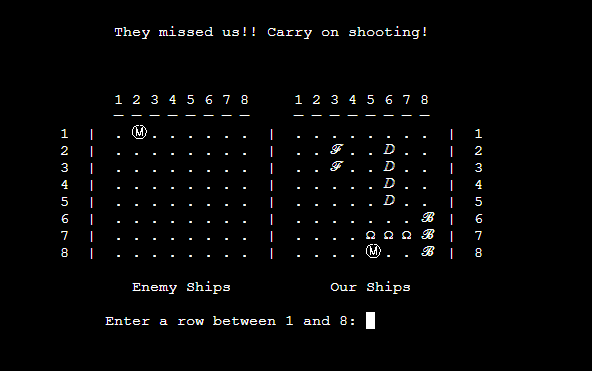

If a miss is made then the screen is updated with an "M" in a circle to make it clearer. If a hit is made then a skull and crossbone appears over the hit. If the user makes a hit the text reads "direct hit, well done". If the computer makes a hit the text reads "One of our ships has been hit!": Note the skull and crossbone can be seen in the bottom of the screen shot below, coordinate 8, 1 

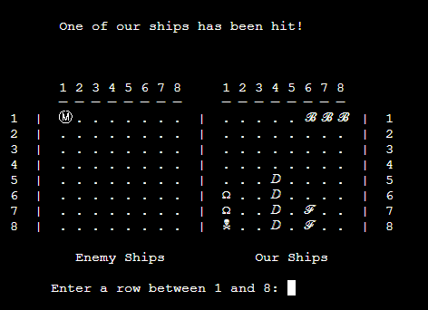

If the user chooses coordinates they have already show at they are shown the warning below and asked to choose again: 

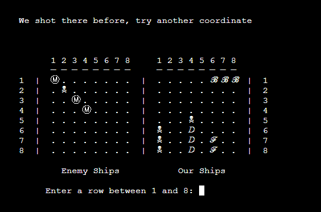

Once a specific ship has been destroyed, be it the users or the computers that ship is named (this is outlined in the rules)

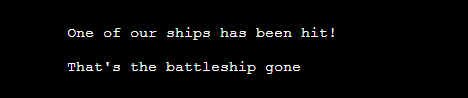

The game continues until either the user or the computer have no ships left. If the user wins they are shown a "You Win" animation before being taken back to the welcome screen. If the user loses (shown in the animation below) they are shown a "You Lose" animation: 

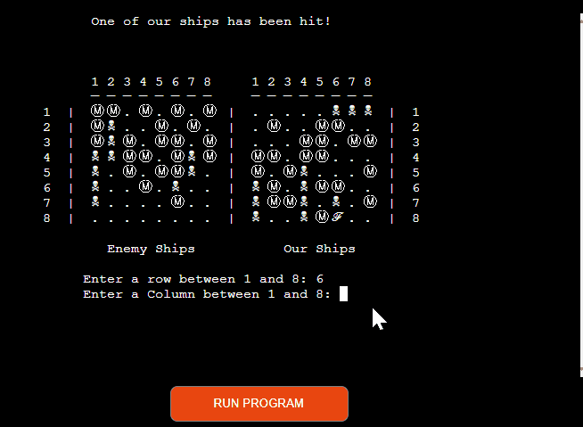

[return to contents](<#contents>)

## Future Enhancements

The project could be improved with the following: 

### User Ship Placement

Allowing the user to place their own ships would improve the game however as time was my limiting factor for this project I had a choice between improving the AI intelligence or adding ship placement. As the ship placement would be an extension of code already present (i.e. checks to ensure placement tiles did not contain a ship already nor were they off the board combined with inputs from the user for starting location and direction) I felt that I had developed the skills to do this and there was greater value to my own learning in developing enhanced computer AI. 

### Multiplayer

Allowing a user to play another player would improve the game though this would require two screens or two computers accessing the app or a period where one player would have to leave the computer while the other player took their turn otherwise each player would simply see where their opponents ships were placed. 

### Enhanced cut scenes

Once ships were destroyed it would be simple to cut away and use ASCII artwork to say "destroyer destroyed" or "Battleship Down" in big lettering. This would add excitement to the game and could be done fairly simply. 

### Improved background

Decorating the screen with a background which would ideally react to the gameplay would be really exciting addition to the project. 

### Improved board appearance

The board is fairly simple and black and white. Although clear it would improve the overall asthetic to have colours on and around the board. 

[return to contents](<#contents>)

## Libraries

I required a number of libraries for this project: 

### random
* random.randint is used for ship placement and for the computer to make initial coordinate guesses whilst on easy and hard mode.

### os
* This import was essential for the display clear command and prevents the app having to create a scroll bar which the user could then scroll up on to old data. This kept the game clean. 

### sys
* "This module provides access to some variables used or maintained by the interpreter and to functions that interact strongly with the interpreter". In this project it was used to allow the slow typing effect seen throughout the intro scenes

### time
* This was used to allow temporary pauses between game events for example a hit or a miss from the computer. It gives the user time to comprehend what is going on on the screen. 

[return to contents](<#contents>)

## Game Map

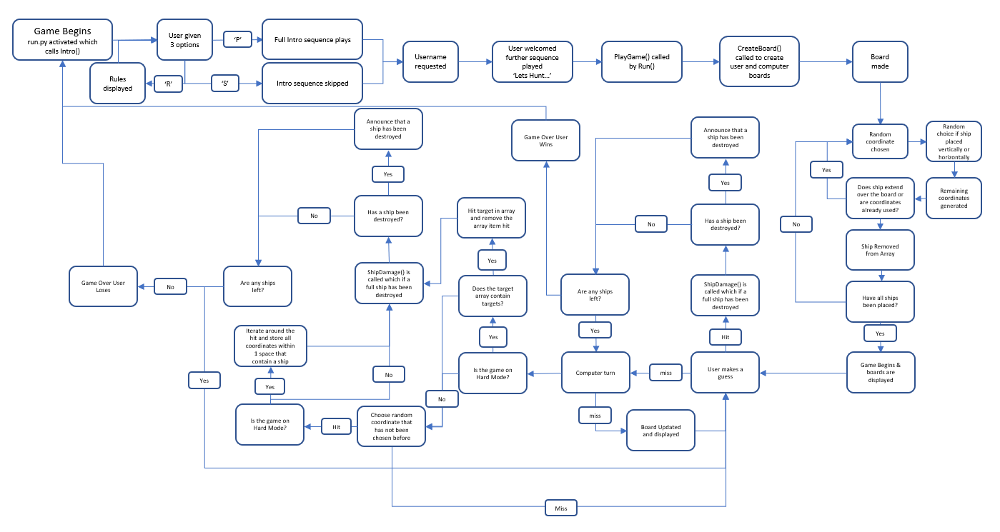

[return to contents](<#contents>)

## Testing

See the testing file [here](TESTING.md) for all testing performed. 

## Playing the Game
This project was only possible due to the [Code Institute template](https://github.com/Code-Institute-Org/python-essentials-template). This created/ simulated a terminal within the web browser and as such the game is not designed to be played locally. It can be but the sizing of the game is designed to be on a screen 80 charachters across. For best results play this using the following link: [Battle Ships](https://dashboard.heroku.com/apps/project3battleships)

[return to contents](<#contents>)

## Deployment to Heroku:
  
This project was deployed to [Heroku](https://www.heroku.com) by using procedure outlined below:    
  
1. Log in to Heroku if you have an account or create a new account if required.
2. click the button labeled "New" visible on the dashboard in the top right corner of the screen.
3. Select "Create new app" from the dropdown
4. Here you should enter a unique app name.
5. If the name is original a green tick will appear.
6. Select the region you are in. 
7. Hit the Create app button.
8. You will now be on the project Deployment tab. Navigate to the settings, a separate tab, and scroll down to the "Config Vars" section. 
9. Here click the button labelled "Reveal Config Vars", the "key" as port should be 8000. Enter this and then hit the "add" button.
10. Next head to the "buildpacks" section still on the settings page and click "add buildpack", select "Python," and then add "Node.js". Save these changes before you prceed. 

Note: it is vital that the buildpacks are in the correct order. If node.js is listed first under this section, you can click and drag it to be below Python.

11. Now navigate to the "Deploy" tab.
12. Once there select Github as the deployment method and Confirm you want to connect to GitHub.
13. Search and select the repository name and hit the connect button next to the intended repository.
14. From the bottom of the deploy page you should select your the desired deployment type  
        * By clicking "Enable Automatic Deploys" the project will update automatically push updates from GitBash to Github.  
        * Select the 'main' branch for deployment from the drop-down menu and click the Deploy Branch button for manual deployment. 

[return to contents](<#contents>)

## Credits
--- 

### Display Clear
The code to clear the console came from this link 

http://www.delftstack.com/howto/python/python-clear-console/

The code was copied in its entirety and housed in the general_functions.py file of my code. 

### Type Slowly
The code to give the type slowly effect in the terminal was taken from stack overflow. Link available below: 

https://stackoverflow.com/a/10390877

This code is housed in the general_functions.py and is called in multiple classes

### Time.Sleep()

The code to allow the game to pause to give the reader time to see what was happening is available below: 

https://www.programiz.com/python-programming/time/sleep

This is used throughout the code in multiple classes

### Check an array's content

The ship placement required an array to be made for temporary coordinates. While these were checked again another array that contained coordinates of tiles already in place. The idea to use the 'any' function to compare two arrays was taken from the link below: 

https://stackoverflow.com/questions/36190533/python-check-if-an-numpy-array-contains-any-element-of-another-array

### ascii artwork

The link below was used to generate all ascii words. 

https://fsymbols.com/generators/carty/

### Side by Side Board

While it may not look it the hardest point of this project for me was getting the boards to appear side by side. While the enumarate/ zip made up part of the code institute coursework and seemed to be the obvious approach the "' '.join" was a 1am success thats discovery meant I could finally go to bed. Information on the ".join" can be found below. 

https://www.w3schools.com/python/ref_string_join.asp

[return to contents](<#contents>)