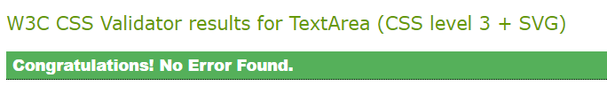

## Testing
---
## Contents
---

* [Testing](#testing)
    * [Contents](#contents)
    * [Manual Testing](#manual-testing)
        * [Pylint](#pylint)
        * [HTML Validator](#html-validator)
        * [CSS Validator](#css-validator)
        * [In Game Testing](#in-game-testing)
        * [Inputs](#inputs)
    * [Bugs](#bugs)

## Manual Testing
---
## Pylint:
Pylint is in the code institute template and was used to "lint" the code. All errors are highlighted

The PEP8 Online system [Link](http://pep8online.com/) was used to check all python code. As Pylint was available throughout there were no errors. 

## HTML Validator

The HTML is part of the code institute template but I ran changes I made through the HTML validator just in case. As you would expect it came back with no errors

## CSS Validator

The CSS is largely part of the code institute template but I ran it through the CSS validator just in case. As you would expect it came back with no errors

## In Game Testing:
Throughout the development process I was testing the game in the gitbash terminal. Once complete the game was repeatedly tested in the CI replica terminal template on Heroku.

The game appears robust and by the time of submission there were no errors. 

## Inputs

The inputs were sources of early bugs due to integers being required and strings delivered. Due to the nature of the code used this should not be an issue but still I test the code by entering the wrong data type

## Bugs

1. Aim: Ships of varying length placed at random throughout the board

Bug: Ships would fall off the board or overlap
Fix: Two issues here, fixed with two methods
    1. Ships falling off the board was fairly simple. Select a random coordinate, then add the ships length to columns or rows depending on whether the ship was to be placed horizontal or vertical and see if the figure is greater than the board size. If it is re-select the starting coordinate. Continue this process until a space is found for the ship. 
    2. To stop the ships overlapping the starting coordinate + coordinates required to put the ship onto the board are put into a temporary array. The contents of this array are then checked against the array of ships already placed. If there were any matches then the starting coordinate is re-chosen until space is found for the ship. 

2. Aim: Improve AI Intelligence of guesses

My first attempt at this involved the computer creating an array once a hit was made of the hit coordinate with row + 1, Row -1, or Col +1, Col - 1. This would then be used to try to target a ship in the next turn. The issue with this was that it was as successful as guessing randomly each turn in that a 5 x 5 board was cleared in an average of 23 turns. It was therefore fairly pointless. 

Fix: This plan was scrapped and a new method where the computer searches around the hit by 1 space for ships and then stores them in an array to use in later turns. 

3. Aim: Collect a username

Bug: user could enter nothing and have no username. While this isn't a massive problem as the username is only used to welcome the player it still defied the point of the sequence

Fix: The username once entered in the input is stripped of all spaces and the length of what is left is measured. If 0 then the user is asked to enter their username again. This continues until a username of at least 1 is entered.

4. Aim: Have heroku display always centered with no scrolling required. 

Bug: when an incorrect row or column is entered (as in either a string or number outside of 1 - 8) then the user was asked to re-enter but this appeared as a new line which meant if continual numbers were entered incorrectly then more and more extra lines turned up creating a scroll issue where the display clear function would no longer work. 

Fix: Had the display_clear function called when the user enters an incorrect row or column. Then the display function is called to re-create the screen view and ask the user for input again without creating the scroll issue. 

5. Aim: Have emoji's for hit and misses. 

Bug: Emoji's were not the same width as the font used in the template hence when an emoji was entered into the board the columns were no longer in line

Fix: I switched from Emojis to charachters for ships and for hits and misses that were the correct width. 

6. Aim: Display boards side by side

Bug: what a nightmare. The board is an array or arrays or list inside a list. By unpacking it with a for loop you would remove one list but it would still have "[" at the start and "]" at the end. It did not look good. An enumerate / Zip created issues where it did not display the board but a description of what was in the board. 

Fix: In the end, as seems the case in many programming bugs I've experienced, once understood the bug was simple to fix. I used "' '.Join" to join the contents being unpacked with a space inbetween and this cleared all the errors I was getting. 

## Remaining Bugs

At submission no visible bugs were known. 